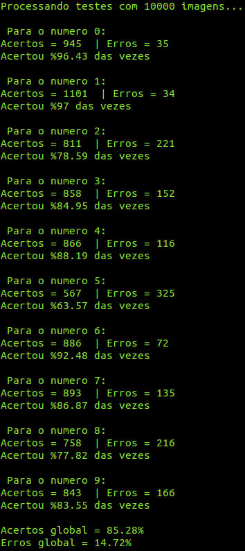

## Perceptron
Implementação simples de perceptrons para o problema de reconhecimento de números MNIST[[1]](https://en.wikipedia.org/wiki/MNIST_database) [[2]](http://yann.lecun.com/exdb/mnist/). Este projeto baseia-se em implementações voltadas para PHP como o do desenvolvedor jtet[[3]](https://github.com/jtet/Perceptron) com a adição de uma interface de uso por linha de comando (exemplos a seguir). Utiliza especificação de treinamento implementadas em C por Matt Lind[[4]](https://github.com/mmlind/mnist-1lnn/).

Para instalação:
```bash
composer install
```

Não é necessário usar a interface em linha de comando (run.php) pode reutilizar a classe Perceptron como desejar em seu programa.
```bash
require_once __DIR__ . '/vendor/autoload.php';

use Neural\Perceptron;

$perceptron = new Perceptron($quantidadeEntradas);
$perceptron->train($conjuntoEntradas, $alvo);
$teste = $perceptron->test($entradasParaTeste);
```

Existem funções para importação de dados de CSV e exportação de pesos em arquivo JSON para posterior uso em testes.


### Usando a interface em linha de comando
Testado somente em ambiente Linux.

[](https://asciinema.org/a/bpla466tn2d5n6wgf0tj7wjph)


### Treinamento

    Gera pesos randômicos para todos os neurônios (valores até um máximo de 0.4999...)
    Para cada neurônio criado (10 Perceptrons)    
        erro = alvo - saída do neurônio
        Para todos os pesos i
            peso[i] += taxa_aprendizado * erro * entrada[i]
        Se (erro != desejado) somaErros++


### Testes
Teste realizado após treinamento com 15 épocas/eras e 18 mil imagens (30 minutos):





#### Referências:

1. [https://en.wikipedia.org/wiki/MNIST_database](https://en.wikipedia.org/wiki/MNIST_database)
2. [http://yann.lecun.com/exdb/mnist/](http://yann.lecun.com/exdb/mnist/)
3. [https://github.com/jtet/Perceptron](https://github.com/jtet/Perceptron)
4. [https://github.com/mmlind/mnist-1lnn/](https://github.com/mmlind/mnist-1lnn/)
 
